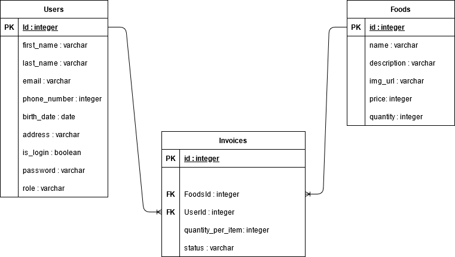

# Bakmi_Polim
## ERD 
Project ini terdiri dari 3 table yaitu Users, Foods, dan Invoices.
Dimana Invoices merupakan junction table dari hasil many to many relationship.

# Backend
## MVP
> - Project ini menggunakan Nodemailer untuk mengirim email dan memverifikasi users ketika register serta mengkonfirmasi pesanan yang telah di beli oleh users/customers.

## Alur program - TBD
> 1. user login dan di redirect ke halaman home lagi
>       - user yang sudah login akan tetap berstatus login selama 5 menit (Session Storage)
> 2. jika status account user blm terverifikasi maka user tidak dapat membeli makanan
> 3. setiap item yang di add akan tampil di cart
> 4. user melakukan checkout melalui cart
> 5. jika process checkout selesai user mendapatkan email konfirmasi pemesanan
> 6. user dapat menemukan status dari pesanan di navigasi status order

## Validasi
### Validasi saat register account
> 1. password harus memiliki panjang character dari 5-20
> 2. username harus memiliki panjang character dari 5-20
> 3. alamat address tidak boleh kosong dan harus lebih dari 20 character
> 4. phone_number tidak boleh kosong 
>       - tidak boleh memiliki char string
>       - panjang harus lebih dari 10 character
> 5. birth_date tidak boleh kosong dan bertipe date
> 6. first_name dan last_name tidak boleh kosong dan tidak boleh berisi angka

## Hook
> 1. mengupdate is_login menjadi true ketika user login
> 2. hoook before create untuk memasukan password yg sudah di hash
## Middleware
> 1. di gunakan meredirect user ketika login ke page tertentu

## Instance methods
> 1. mengkonversi timestamp dari output new Date() menjadi toLocaleDateString di model User
> 2. menkonversi price pada instance Food menjadi toLolaceString dengan format IDR.

## Helper
> 1. menggunakan helper function untuk menghitung total harga pada Model Invoice

# Frontend
>   ## 1. Bootstrap
